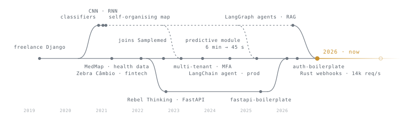

```
██████╗ ██╗███████╗███████╗██╗███╗   ██╗ █████╗ ████████╗████████╗██╗
██╔══██╗██║██╔════╝██╔════╝██║████╗  ██║██╔══██╗╚══██╔══╝╚══██╔══╝██║
██████╔╝██║███████╗███████╗██║██╔██╗ ██║███████║   ██║      ██║   ██║
██╔═══╝ ██║╚════██║╚════██║██║██║╚██╗██║██╔══██║   ██║      ██║   ██║
██║     ██║███████║███████║██║██║ ╚████║██║  ██║   ██║      ██║   ██║
╚═╝     ╚═╝╚══════╝╚══════╝╚═╝╚═╝  ╚═══╝╚═╝  ╚═╝   ╚═╝      ╚═╝   ╚═╝
```

<sub>Marcus Vinicius Pissinatti · backend engineer at <a href="https://github.com/Samplemed">@Samplemed</a> · Chuck to almost everyone, Marcus when the bug is serious.</sub>

<picture>
  <source media="(prefers-color-scheme: dark)" srcset="assets/convergence-dark.svg">
  
</picture>

For four years I have been one of the main hands behind Sample360, a health platform that insurers and underwriters use every day: hundreds of merged pull requests and code reviews on a single production codebase, from tenant isolation and login to the questionnaire engine and the background pipelines.

Python is the trade. Rust comes out when latency is the whole point. I came to programming for neural networks, stayed for the backend, and the two have met again: most of what I build now has a model somewhere in the pipeline.

---

#### Six stages, one loop

```
    ╔═══════════════════╗     ╔═══════════════════╗     ╔═══════════════════╗
 ┌─→║ 01 · 2020 → 2021  ║     ║ 02 · 2021 → 2022  ║     ║ 03 · 2022 → 2025  ║
 │  ║ NEURAL NETWORKS   ║     ║ DJANGO & THE WEB  ║     ║ SAMPLEMED         ║
 │  ║ █░░░░░ learning   ║ ──→ ║ ██░░░░ shipping   ║ ──→ ║ ████░░ owning     ║
 │  ╟───────────────────╢     ╟───────────────────╢     ╟───────────────────╢
 │  ║ image and tabular ║     ║ Django-ecommerce  ║     ║ multi-tenant, one ║
 │  ║ classifiers, CNN  ║     ║ storefront    ★5  ║     ║ Postgres / client ║
 │  ║ on CIFAR-10, RNN  ║     ║ Management-       ║     ║ JWT + MFA + OAuth ║
 │  ║ on stock prices,  ║     ║ Sistem        ★3  ║     ║ questionnaire     ║
 │  ║ a self-organising ║     ║ first DRF API,    ║     ║ engine · Celery   ║
 │  ║ map on credit     ║     ║ first FastAPI +   ║     ║ 800+ PRs merged   ║
 │  ║ fraud             ║     ║ Docker + Celery   ║     ║ 200+ reviewed     ║
 │  ╚═══════════════════╝     ╚═══════════════════╝     ╚═════════╤═════════╝
 │                                                                │
 │           ┌────────────────────────────────────────────────────┘
 │           │
 │  ╔═════════╧═════════╗     ╔═══════════════════╗     ╔═══════════════════╗
 │  ║ 04 · 2025 → 2026  ║     ║ 05 · 2026         ║     ║ 06 · NOW          ║
 │  ║ FOUNDATIONS       ║     ║ RUST & UPSTREAM   ║     ║ LLM AGENTS        ║
 │  ║ █████░ building   ║ ──→ ║ █████░ giving back║ ──→ ║ ██████ converging ║
 │  ╟───────────────────╢     ╟───────────────────╢     ╟───────────────────╢
 │  ║ fastapi-          ║     ║ webhook-ingester  ║     ║ finance-ai-       ║
 │  ║ boilerplate   ★1  ║     ║ 14k req/s, axum   ║     ║ assistant: agent  ║
 │  ║ auth-boilerplate  ║     ║ apache/airflow    ║     ║ with tools, RAG,  ║
 │  ║ observability     ║     ║ PR #71719 (open)  ║     ║ semantic cache    ║
 │  ║ demo: SSE +       ║     ║ opentelemetry-    ║     ║ market-insights:  ║
 │  ║ Prometheus        ║     ║ python PR #4964   ║     ║ a local LLM       ║
 │  ║ portfolio     ★1  ║     ║ (open)            ║     ║ curates the feed  ║
 │  ╚═══════════════════╝     ╚═══════════════════╝     ╚═════════╤═════════╝
 │                                                                │
 └─── the 2020 strand, back in the loop: every stage feeds NOW ────┘
```

#### Impact

- **800+ pull requests merged** into one production codebase since 2022, and a few hundred reviewed for the same team.
- **6 minutes down to 45 seconds** for risk calculation and reporting, moved onto Celery and AWS Lambda pipelines.
- **A LangChain agent in production** inside that platform, wired to its internal data sources.
- **Own the hard parts** of a multi-tenant platform: per-client databases, JWT + MFA + OAuth2 login, the dynamic questionnaire engine, Celery pipelines.
- **14k requests a second** on a webhook front-end written in Rust, so provider retry storms never reach the app.
- **Open pull requests upstream** to [Apache Airflow](https://github.com/apache/airflow/pull/71719) and [OpenTelemetry Python](https://github.com/open-telemetry/opentelemetry-python-contrib/pull/4964).

---

#### Selected work

- **[webhook-ingester](https://github.com/Pissinatti-py/webhook-ingester)** — A tiny front door for incoming webhooks. It checks the sender is real, throws away duplicates and queues the rest, handling **14k requests a second** so a flood of retries from a provider never touches the real app. `Rust · axum · Redis`
- **[finance-ai-assistant](https://github.com/Pissinatti-py/finance-ai-assistant)** — A personal-finance assistant that answers from your own data. It remembers past answers so it never pays for the same question twice, and the search side runs on your own machine, no second vendor needed. `Python · LangGraph · pgvector`
- **[market-insights-service](https://github.com/Pissinatti-py/market-insights-service)** — Collects what is trending in software (GitHub, PyPI, npm, articles), removes duplicates and has a local model write the digest. Safe to re-run at any time: nothing gets stored twice. `Python · FastAPI · Celery · Ollama`
- **[fastapi-observability-demo](https://github.com/Pissinatti-py/fastapi-observability-demo)** — Watch a long-running job progress live in the browser, with every request and job graphed in Grafana. `Python · SSE · Prometheus`
- **[fastapi-boilerplate](https://github.com/Pissinatti-py/fastapi-boilerplate)** and **[auth-boilerplate](https://github.com/Pissinatti-py/auth-boilerplate)** — The starting point every service above is built on, with login, MFA and roles already solved. `Python · SQLAlchemy 2.0 · Alembic · Docker`
- **[portfolio](https://github.com/Pissinatti-py/portfolio)** — My site, at [pissinatti-py.github.io/portfolio](https://pissinatti-py.github.io/portfolio/). Command palette and scroll-driven animation, built without an animation library. `Vue 3 · TypeScript`

#### Open source

Two pull requests currently open upstream, both from August 2026:

- [apache/airflow #71719](https://github.com/apache/airflow/pull/71719) — hide sensitive connection fields in the UI form instead of showing them in plain text.
- [open-telemetry/opentelemetry-python-contrib #4964](https://github.com/open-telemetry/opentelemetry-python-contrib/pull/4964) — fix and re-enable the flaky Celery docker tests.

#### Where I started — [@Chuckpy](https://github.com/Chuckpy)

My first account, still online. Django apps and machine-learning experiments from 2020–2022, back when I was learning both at once.

- **[Django-ecommerce](https://github.com/Chuckpy/Django-ecommerce)** ⭐5 — Full storefront built on Django; my most-starred project.
- **[Management-Sistem](https://github.com/Chuckpy/Management-Sistem)** ⭐3 — Django + Bootstrap system for managing and organising records.
- **[SOM_suspicious-credit-activity](https://github.com/Chuckpy/SOM_suspicious-credit-activity)** — Self-organising map that ranks credit applicants by how suspicious their activity looks.
- **[python-monopoly](https://github.com/Chuckpy/python-monopoly)** — Monopoly simulator in pure standard-library Python, run over many trials to compare player strategies.

---

#### What I'm working on

| | |
|---|---|
| **Building** | `market-insights-service` — market signals collected, deduplicated and curated by a local LLM |
| **Maintaining** | `fastapi-boilerplate` and `auth-boilerplate`, the scaffolding everything else sits on |
| **Exploring** | Rust on latency-critical paths · LLM agents that run without a cloud vendor |
| **Working** | Sample360 at [@Samplemed](https://github.com/Samplemed) — a multi-tenant health platform on Django + Vue 3 |

#### Stack

```
Languages   Python · Rust · TypeScript
Backend     FastAPI · Django / DRF · SQLAlchemy 2.0 (async) · Celery · axum
Data        PostgreSQL · pgvector · Redis
Ops         Docker · GitHub Actions · Prometheus · Grafana · uv
AI          LangGraph · Anthropic API · Ollama · RAG · semantic caching
```

---

[Portfolio](https://pissinatti-py.github.io/portfolio/) · [LinkedIn](https://www.linkedin.com/in/marcusviniciusfonsecap) · [marcusandrade.37@gmail.com](mailto:marcusandrade.37@gmail.com)
